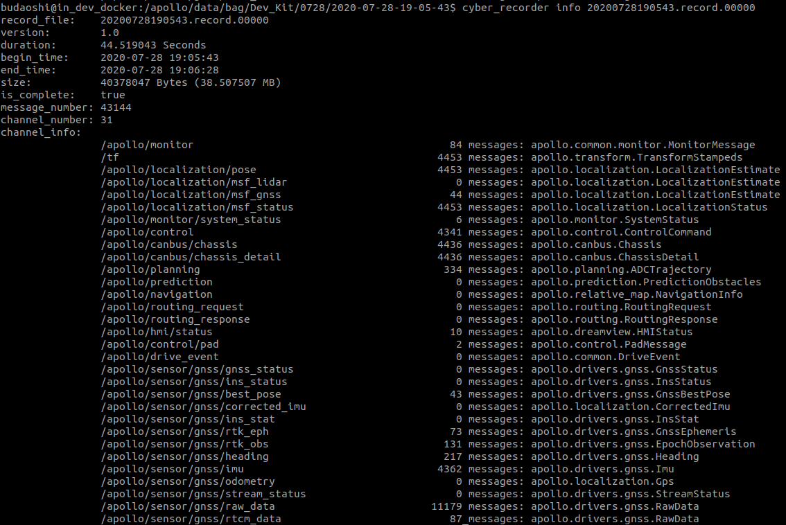
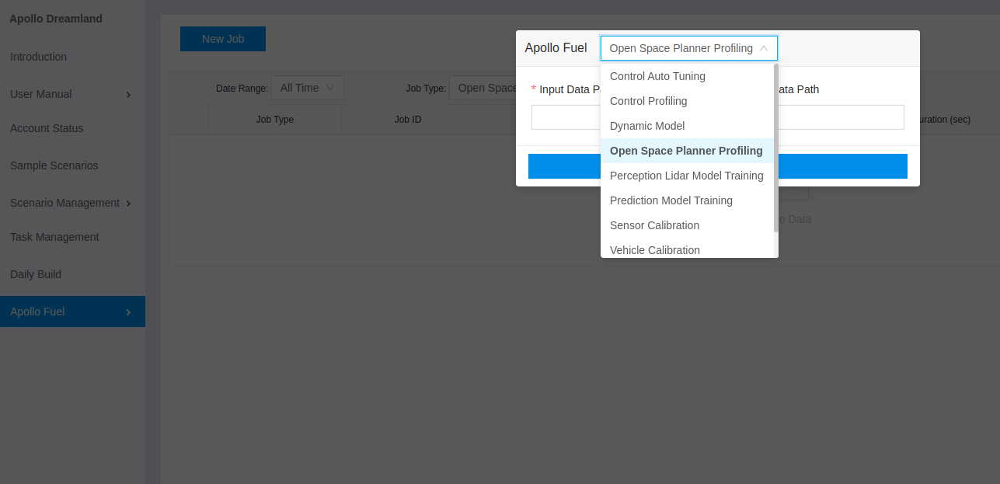
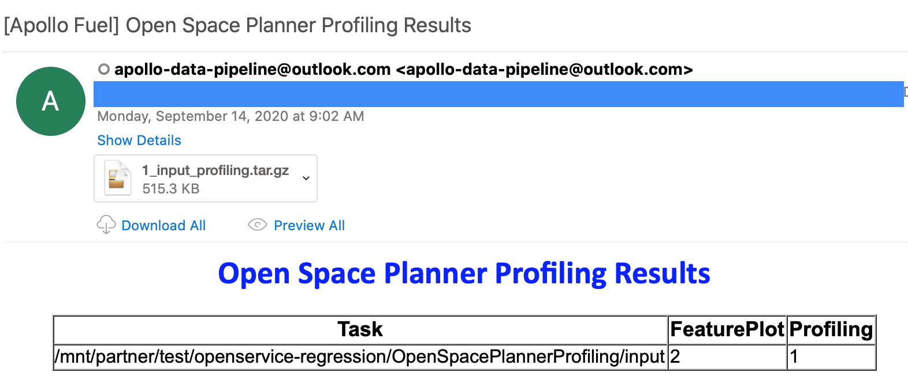

# Open Space Planner Profiling Service

## Overview

Open Space Profiling Service is a cloud based service to evaluate the open space planner trajectories from road test or simulation records.


## Prerequisites

- [Century](https://github.com/CenturyAuto/century) 6.0 or higher version.

- Baidu Cloud BOS service registered according to [document](https://github.com/CenturyAuto/century/blob/master/docs/Century_Fuel/apply_bos_account_cn.md)

- Fuel service account on [Century Dreamland](http://bce.century.auto/user-manual/fuel-service)

## Main Steps

- Data collection

- Job submission

- Results analysis


## Data Collection

### Data Recording

Finish one autonomous driving scenario with open space planner, e.g. Valet Parking, PullOver, Park and Go.

### Data Sanity Check

- **Make sure the following channels are included in records before submitting them to cloud service**：

    | Modules | channel | items |
    |---|---|---|
    | Canbus | `/century/canbus/chassis` | exits without error message |
    | Control | `/century/control` | exits without error message |
    | Planning | `/century/planning` | - |
    | Localization | `/century/localization/pose` | - |
    | GPS | `century/sensor/gnss/best_pose` | `sol_type` to `NARROW_INT` |

-  You can check with `cyber_recorder`：

```
    cyber_recorder info xxxxxx.record.xxxxx
```




## Job Submission

### Upload data to BOS

Here is the folder structure requirements for job submission:
1. A cyber record file containing the execution of open space planner scenario.

1. A configuration file `vehicle_param.pb.txt`; there is a sample file under `century/modules/common/data/vehicle_param.pb.txt`.

### Submit job in Dreamland

Go to [Century Dreamland](http://bce.century.auto/), login with **Baidu** account, choose `Century Fuel --> Jobs`，`New Job`, `Open Space Planner Profiling`，and input the correct BOS path as in [Upload data to BOS](###Upload-data-to-BOS) section：




## Results Analysis

- After job is done, you should be expecting one email per job including `Grading results` and `Visualization results`.


