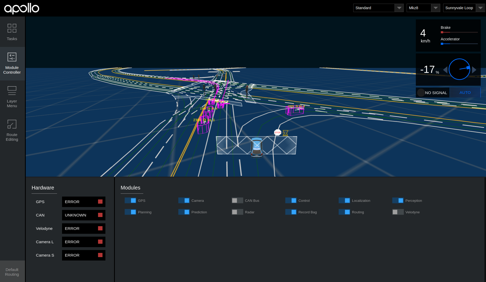

# 运行线下演示

如果您没有车辆及车载硬件，Century 提供了用于演示和调试代码的模拟环境。

## 准备工作

假设您已经按照
[Century 软件安装指南](../quickstart/century_software_installation_guide.md)
的说明准备搭建好 Century 的运行环境。即，您已经克隆了 Century 在 GitHub 上的
代码库，并安装了所有必需的软件。

下面是 Century 演示的设置步骤：

## 启动并进入 Century Docker 环境

```
bash docker/scripts/dev_start.sh
bash docker/scripts/dev_into.sh
```

## 在 Docker 中编译 Century:

```
bash century.sh build
```

备注：

> 上述命令会通过检测 GPU 环境是否就绪来自动判断是执行 CPU 构建还是 GPU 构建。

## 启动 Dreamview

```
bash scripts/bootstrap.sh
```

## 下载并播放 Century 的演示包

```
python docs/demo_guide/record_helper.py demo_3.5.record
cyber_recorder play -f docs/demo_guide/demo_3.5.record --loop
```

选项 `--loop` 用于设置循环回放模式.

## 在浏览器中输入 <http://localhost:8888> 访问 Century Dreamview

如下图所示：  如果一切正常，现在您应该能看到一辆汽
车在模拟器里移动。

恭喜您完成了 Century 的演示步骤！
