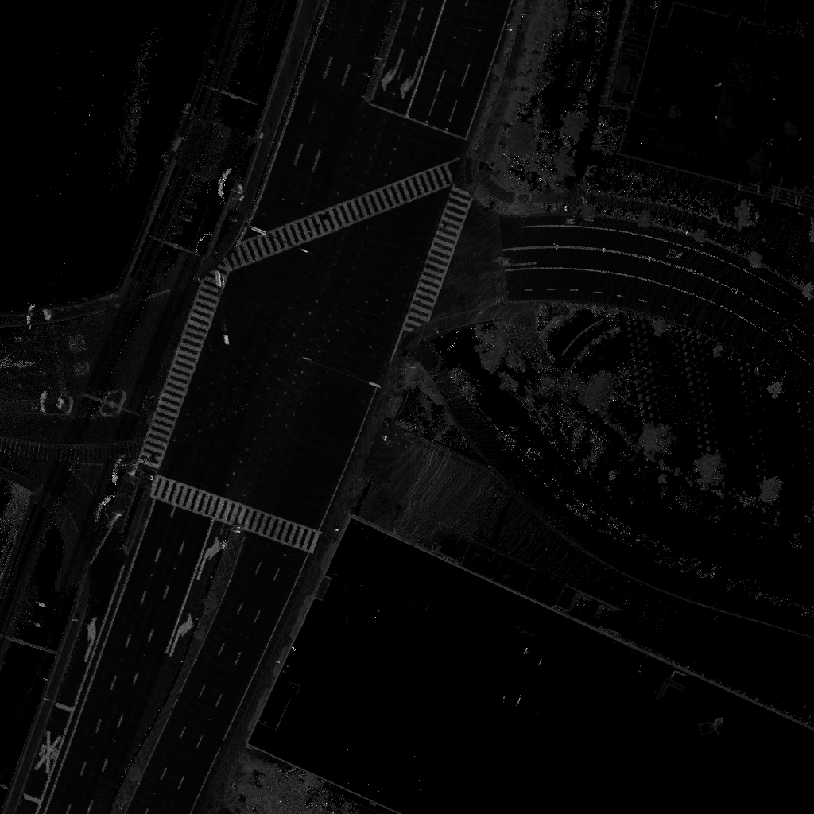

# 如何生产多传感器融合定位模块所需的地图

本文档介绍了如何利用century开源的工具生产多传感器融合定位模块所需要的地图。

## 1. 事先准备
 - 从[GitHub网站](https://github.com/CenturyAuto/century)下载Century源代码
 - 按照[教程](../quickstart/century_software_installation_guide.md)设置Docker环境
 - ~~从[Century数据平台](http://data.century.auto/?name=sensor%20data&data_key=multisensor&data_type=1&locale=en-us&lang=en)的“多传感器融合定位数据”栏目下载多传感器融合定位demo数据包（仅限美国地区）。~~
 - 下载数据集： 请发邮件至*zhouyao@baidu.com*来申请数据。邮件中需要包含以下内容：(1) 你所在的机构名称和邮件地址; (2)数据集使用目的。

## 2. 编译century工程

### 2.1 构建docker容器
我们提供了一个叫做*dev-latest*的docker镜像，docker容器会将你本地的century工程挂载到 */century* 。
```
bash docker/scripts/dev_start.sh
```
### 2.2 进入docker容器
```
bash docker/scripts/dev_into.sh
```
### 2.3 编译工程
```
# To make sure you start clean
bash century.sh clean
# Build the full system
bash century.sh build_opt
```

## 3. 生产定位地图

在下载好的定位demo数据中，找到一个名为"century3.5"的文件夹，将其中的数据包解压，假设该文件夹所在路径为DATA_PATH。

执行以下脚本
```
/century/scripts/msf_simple_map_creator.sh DATA_PATH/records/ DATA_PATH/params/velodyne_params/velodyne128_novatel_extrinsics.yaml 10 OUT_FOLDER_PATH
```
该脚本会在OUT_FOLDER_PATH的路径下生成定位需要的地图。

下图为地图中某个node使用LiDAR放射值进行渲染的效果。

