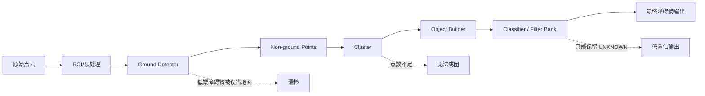
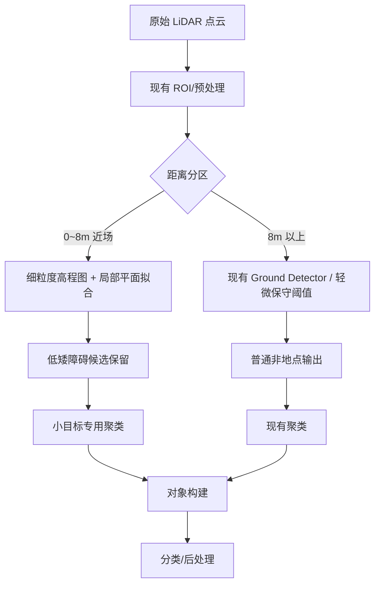
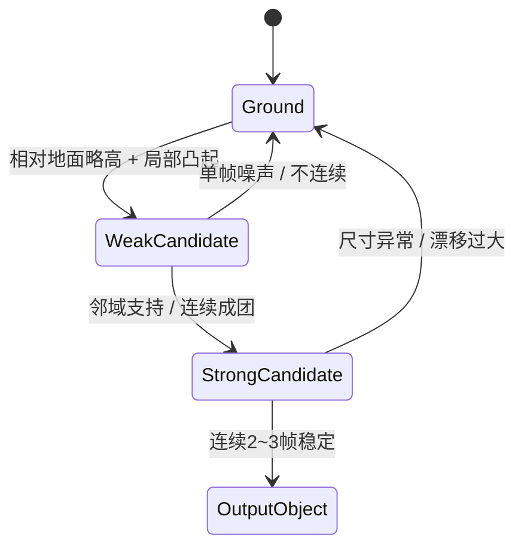
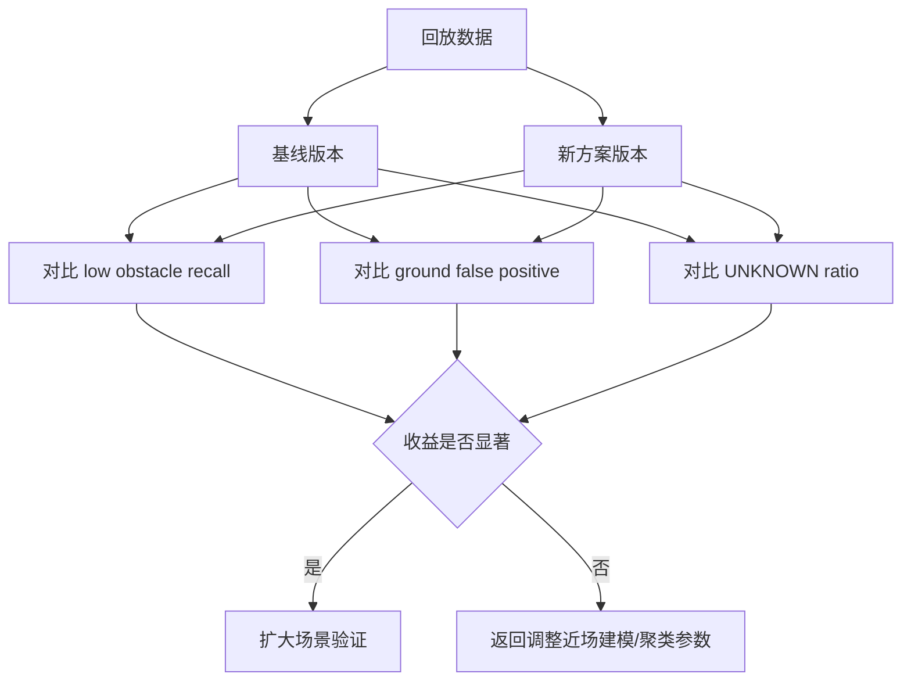

# 低矮障碍物鲁棒检测落地方案（LiDAR）

## 1. 背景与问题定义

当前 LiDAR 地面分割常采用固定高度阈值或近似固定阈值策略，例如将点到地面的相对高度控制在 0.20 m ~ 0.25 m 以内视为地面。这类方法实现简单、实时性高，但对**低矮障碍物**并不鲁棒，尤其是在以下场景中容易出现漏检：

- 锥桶、路沿、小型隔离墩、散落物等高度仅高出地面 5 cm ~ 25 cm；
- 障碍物距离自车很近，底部点云密集但高度起伏很小；
- 障碍物贴近大车、护栏、墙体等大物体边缘，局部地面模型被污染；
- 坡道、井盖、减速带、接缝、局部起伏地面引入伪高差。

在这类情况下，如果阈值偏大，低矮障碍物会在 ground stage 被直接吃掉；如果阈值偏小，则地面噪声、起伏、边界点又会被误报为障碍物。因此，单一高度阈值无法同时兼顾**低矮障碍物召回率**与**地面误检率**。

---

## 2. 当前问题在链路中的位置

结合当前 Century LiDAR 处理链路，可将问题拆成如下几个阶段：

对低矮目标来说，**首要失效阶段通常是 Ground Detector**。因为一旦锥桶底部和主体低位点在地面分割阶段被删除，后续聚类仅能拿到零散点：

- 要么聚类点数不足，直接无法成团；
- 要么能成团，但几何尺寸退化，只能输出 `UNKNOWN`；
- 再往后的 cone filter / temporal filter 只能做增强，无法从“已丢失点云”中恢复目标。

因此，方案设计必须优先解决“**如何保住真正的低矮非地点**”，而不是单纯放宽聚类阈值。

---

## 3. 目标与约束

### 3.1 目标

本方案目标是：

1. 提升近场低矮障碍物（锥桶、路沿、小隔离物）的召回率；
2. 不显著增加平坦地面、坡道、接缝等区域的误检；
3. 尽量兼容当前 Century LiDAR 生产链路，控制改造范围和上线风险；
4. 支持渐进落地：先配置/轻量算法优化，再逐步演进到更强模型。

### 3.2 约束

- 不应大规模重写现有主链路；
- 必须满足在线实时性；
- 必须保留现有中远场稳定性；
- 需要能解释误检与漏检来源，便于量产调参。

---

## 4. 可选算法路线对比

### 4.1 路线 A：继续使用固定阈值，局部微调

这是改动最小的方式，通过细化近场阈值、收紧近场作用范围来减少近场低矮障碍物漏检。

优点：

- 开发和验证成本最低；
- 易于直接复用当前 ground detector；
- 不影响整体架构。

缺点：

- 仍然是阈值驱动，本质鲁棒性有限；
- 对场景变化、坡道、地面起伏适应性不足；
- 不适合作为最终方案，只适合作为过渡方案。

### 4.2 路线 B：高程图（Elevation Map）+ 局部梯度/方差

该路线将地面表示为 2.5D 网格，每个格子维护局部高度统计量，如均值、最小值、方差、邻域梯度。点是否为障碍物，不再看其是否高出一个固定全局阈值，而是看其是否**相对局部邻域地面显著抬升**。

优点：

- 对低矮目标比固定阈值鲁棒；
- 对坡道、缓变路面适应更好；
- 可解释性强，工程实现难度适中；
- 非常适合作为当前系统的主升级方向。

缺点：

- 网格分辨率、滤波窗口、梯度阈值需要仔细设计；
- 若栅格过大，会抹平小目标；若过小，则噪声敏感。

### 4.3 路线 C：局部平面拟合（RANSAC / PCA / Polar Grid）

该路线在局部区域拟合一个或多个地面平面，再使用“点到局部平面的距离”而非“点到全局地面的距离”进行分类。适合坡道、弯曲地面、停车坡道等非平地环境。

优点：

- 地面建模能力比固定阈值更强；
- 对中近场地面起伏有更好适应性；
- 与高程图天然兼容，可组合使用。

缺点：

- 当局部区域被大障碍物污染时，拟合平面可能偏移；
- 需要更细粒度的邻域设计。

### 4.4 路线 D：GPR / CRF / 深度学习分割

这些方法可以进一步提升复杂场景下的鲁棒性，但在当前阶段不建议作为第一落地点。

原因：

- GPR 计算开销和参数复杂度更高；
- CRF/MRF 更适合作为后处理增强，而非最先上线；
- 端到端点级分割需要专门数据、训练、部署和域适配，改造成本最高。

结论：**最适合 Century 当前链路的落地方向是“路线 B + 路线 C 的近场组合”**。

---

## 5. 推荐落地方案

推荐采用以下分层方案：

### 5.1 核心思想

不要让所有距离、所有目标都走同一套地面判定逻辑，而是按“**近场低矮敏感区**”和“**普通区域**”分开处理。

近场区域：

- 使用更细网格（例如 0.1 m ~ 0.2 m）构建局部高程图；
- 为每个格子估计最低地面高度、局部坡度、邻域高度变化；
- 对满足“高度略高于地面，但空间上连续、局部凸起稳定”的点做保留；
- 输出给一个**近场小目标专用聚类器**。

普通区域：

- 保持现有地面分割逻辑，只做保守修正；
- 保持当前性能与稳定性，不扩大改动面。

### 5.2 为什么这样更稳

因为低矮障碍物问题本质上不是“高度不够高”，而是“**相对局部地面结构有意义，但绝对高度太低**”。

固定阈值只看绝对高度；
局部高程图 + 平面拟合看的是：

- 是否明显高于邻域最低地面；
- 是否形成局部连贯凸起；
- 是否有稳定边界梯度；
- 是否连续出现在相邻格子/相邻帧中。

这正是锥桶、路沿、散落物与纯地面噪声的关键区别。

---

## 6. 方案详细设计

### 6.1 近场区域定义

建议先定义一个近场敏感区：

- 距离：0 m ~ 8 m；
- 高度：聚焦于地面以上 0 m ~ 0.35 m 的低矮突起；
- 横向：优先覆盖自车周边和大车边缘盲区区域。

该区域内点云密度高，最适合做小目标增强。

### 6.2 近场地面建模

每一帧在近场构建高程图网格：

- 栅格分辨率：0.1 m ~ 0.15 m；
- 每个格子统计：
  - 最低点高度；
  - 平均高度；
  - 高度方差；
  - 邻域高度梯度；
  - 点数。

然后对每个格子进行局部平面/局部地面估计：

- 若邻域平坦，则采用局部最低值 + 平滑；
- 若邻域存在坡度，则采用 PCA/RANSAC 拟合局部地面平面；
- 对异常大物体边缘区域引入邻域一致性约束，防止障碍物侧面污染地面模型。

### 6.3 低矮障碍候选提取

对每个点或每个网格单元，计算相对局部地面的特征：

- 相对高度 `dz`；
- 邻域高度突变 `grad_z`；
- 局部粗糙度 `roughness`；
- 空间连通性 `connectivity`。

建议使用双阈值迟滞而不是单阈值：

- `strong obstacle`：明显高于地面，直接保留；
- `weak obstacle`：高度接近阈值，但只要邻域中存在 strong obstacle 或形成连续凸起，也保留；
- 其余点仍视为地面。

这样能显著降低“边缘一点点高差就误检”的风险。

### 6.4 小目标专用聚类分支

对近场低矮候选点，不建议完全复用中远场聚类参数，而应走一条小目标专用分支：

- 更小的最小点数阈值；
- 更紧的聚类半径；
- 更严格的最大尺寸约束；
- 更严格的底面积/高宽比过滤。

锥桶、小路障这类目标通常点数少、尺寸稳定、形状集中，因此应使用“**低点数阈值 + 强形状先验**”而不是“高点数阈值 + 弱形状先验”。

### 6.5 时序稳定与误检抑制

为了避免把地面抖动、边缘噪声、车身反射误报成障碍物，建议加入轻量时序机制：

- 单帧弱候选不直接输出；
- 连续 2~3 帧稳定出现才升级为正式小目标；
- 如果只出现一帧且位置飘移明显，则快速衰减；
- 对大车边缘邻近区域可额外提高时序一致性要求。

---

## 7. 分阶段实施计划

### 阶段 1：低风险版本（推荐立即启动）

目标：在现有链路上最小代价验证收益。

内容：

1. 保留现有中远场 ground detector；
2. 仅对近场区域引入更细粒度网格统计；
3. 使用局部高程差 + 邻域梯度做低矮候选保留；
4. 输出到现有聚类前，形成单独的 near-field candidate mask；
5. 通过回放验证低矮锥桶召回是否提升。

特点：

- 改动小；
- 不要求训练数据；
- 最快拿到工程反馈。

### 阶段 2：稳定性增强版本

目标：降低误检并提升复杂路面适应性。

内容：

1. 在近场加入局部平面拟合；
2. 对坡道/井盖/减速带等区域采用地面法向一致性判定；
3. 增加双阈值迟滞和 2~3 帧时序稳定逻辑；
4. 引入小目标专用聚类和尺寸过滤。

### 阶段 3：高性能版本

目标：进一步逼近最优召回和复杂场景泛化。

内容：

1. 在近场增加点级语义辅助分割，专门学习 cone/curb/debris；
2. 或引入 GPR/CRF 处理 ambiguity region；
3. 构建回放数据集和自动评测闭环。

---

## 8. 建议的验证方案

### 8.1 样本集构建

建议至少覆盖以下场景：

- 近距离单锥桶；
- 锥桶贴近大车/货箱边缘；
- 低矮路沿；
- 减速带、井盖、接缝；
- 坡道和斜坡地面；
- 夜晚、雨天、点云稀疏场景。

### 8.2 关键指标

重点关注：

- 低矮目标召回率；
- 地面误检率；
- 近场 UNKNOWN 比例；
- 聚类成功率；
- 在线处理时延。

### 8.3 验证逻辑

---

## 9. 推荐结论

对于当前 Century LiDAR 链路，最可落地、性价比最高的方案不是继续围绕单一 ground threshold 做大范围调参，而是：

**在近场增加“高程图 + 局部平面拟合 + 双阈值迟滞 + 小目标专用聚类”的组合分支，中远场保持现有逻辑。**

这样做的原因是：

- 低矮障碍物问题主要发生在近场；
- 近场点云密度足够高，适合使用局部几何建模；
- 中远场维持现状可以控制风险；
- 该路线不依赖大规模训练数据，适合快速工程落地。

如果只允许做一件事，优先级建议如下：

1. 先做**近场高程图 + 局部梯度保留**；
2. 再加**局部平面拟合**；
3. 再补**小目标专用聚类与时序稳定**。

这是在“低矮障碍物召回率、地面误检率、工程改造成本、上线风险”之间最平衡的一条路线。
